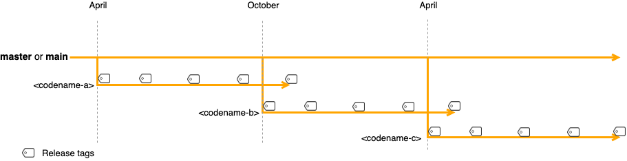
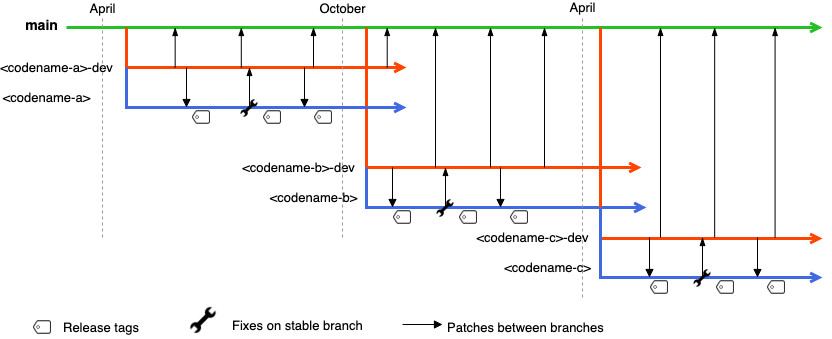

Codeline Management
===================

The EWAOL project is released and developed based on Yocto's release branch
process. This strategy allows us to make Major, Minor and Point/Patch Releases
based on upstream stable branches, reducing the risk of having build and runtime
issues.

Yocto Release Process Overview
------------------------------

The diagram above gives an overview of the Yocto branch and release process:

* Development happens primarily in the master (or main) branch.
* The project has a major release roughly every 6 months where a stable release
  branch is created.
* Each major release has a `codename` which is also used to name the stable
  release branch (e.g. hardknott).
* Once a stable branch is created and released, it only receives bug fixes with
  minor (point) releases on an unscheduled basis.
* The goal is for users and 3rd parties layers to use these codenamed branches
  as a means to be compatible with each other.

For a complete description of the Yocto release process, support schedule and
other details, see the `Yocto Release Process`_ documentation.

EWAOL Branch and Release Process
--------------------------------

EWAOL's branch and release process is based on the Yocto release process. The
following sub-sections describe in more details the branch strategy for EWAOL's
development and release process.

EWAOL main branch
.....................

* Represented by the green line on the diagram above.
* The repository's ``main`` branch is meant to be compatible with ``master`` or
  ``main`` branches from Poky and 3rd party layers.
* ``meta-ewaol`` is not actively developed on this ``main`` branch to avoid the
  instability inherited from Yocto development on the master branch.
* To reduce the effort required to move EWAOL to a new version of Yocto, this
  main branch is periodically updated with patches from the
  `EWAOL development branches`_  on a regular basis.

EWAOL development branches
..........................

* Represented by the red line on the diagram above.
* EWAOL uses development branches based/compatible with Yocto stable branches.
* A development branch in EWAOL is setup for each new Yocto release using the
  name convention ``<codename>-dev`` where `<codename>` comes from target Yocto
  release.
* The development branches in EWAOL are where fixes, improvements and new
  features are developed.
* On a regular basis, code from the development branch is ported over to the
  ``main`` branch to reduce the effort required to move EWAOL to a new version
  of Yocto.

EWAOL release branches
......................

* Represented by the blue line on the diagram above.
* A new release branch in EWAOL is setup for each new Yocto release using the
  Yocto `codename` the branch targets.
* Hot fixes in the release branch are back ported to the development branch.
* Release branches are currently maintained not much longer than a Yocto release
  period (~7 months).

EWAOL release tags
..................

* EWAOL is tagged using the version format ``v<Major>.<Minor>.<Patch>``.
* Tags are always applied to commits from the release branch.
* The first release in a release branch is a `Major` release.
* Following releases in a release branch advance the `Minor` version number.
* `Patch` releases are mainly used for hot fixes which are then back ported to
  the development branch.
* Both `Major` and `Minor` releases may receive fixes, improvements and new
  features while `Patch` releases only receive fixes. Poky and 3rd party layers
  release/stable branches might be updated and pinned.

.. _Yocto Release Process: https://docs.yoctoproject.org/ref-manual/release-process.html
