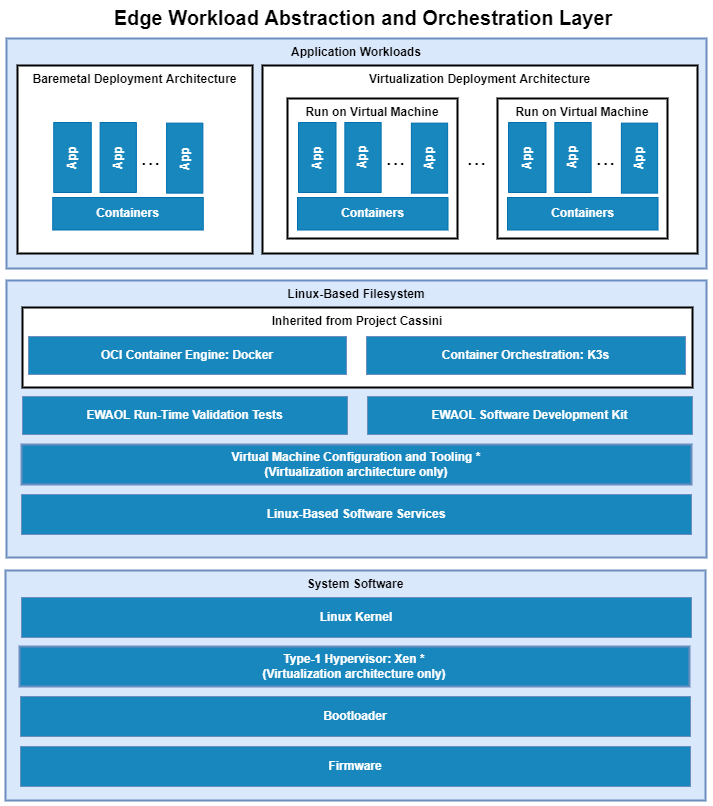

..
 # Copyright (c) 2022, Arm Limited.
 #
 # SPDX-License-Identifier: MIT

############
Introduction
############

The Edge Workload Abstraction and Orchestration Layer (EWAOL) project provides
users with a standards-based framework using containers for the deployment and
orchestration of applications on edge platforms. EWAOL is provided as the
``meta-ewaol`` repository, which includes metadata for building EWAOL
distribution images via the Yocto Project.

Under this approach, a full software stack is divided into the following
software layers:

  * **Application workloads**:

    User-defined container applications that are deployed and executed on the
    EWAOL software stack. Note that the EWAOL project provides the system
    infrastructure for user workloads, and not the application workloads
    themselves. Instead, they should be deployed by end-users according to their
    individual use-cases.

  * **Linux-based filesystem**:

    This is the main component provided by the EWAOL project. The EWAOL
    filesystem contains tools and services that provide EWAOL core
    functionalities and facilitate deployment and orchestration of user
    application workloads. These tools and services include the Docker container
    engine, the K3s container orchestration framework, and Xen virtualization
    management software, together with their run-time dependencies. In addition,
    EWAOL provides supporting packages such as those which enable run-time
    validation tests or software development capabilities on the target platform.

  * **System software**:

    System software specific to the target platform, composed of firmware,
    bootloader and the operating system, as well as the Xen type-1 hypervisor
    when building an EWAOL distribution with hardware virtualization support.
    Note that this system software is not directly developed as part of the
    EWAOL project, but is instead integrated from the meta-arm, meta-arm-bsp,
    and meta-virtualization Yocto layers in order to provide an example EWAOL
    reference stack on the N1SDP hardware target platform.

EWAOL is the reference implementation for SOAFEE (Scalable Open Architecture
For Embedded Edge), the Arm lead industry initiative for extending cloud-native
software development to automotive, with a special focus on real-time and
functional safety. For more details, please see `<http://soafee.io>`_.

More specifically, the ``meta-ewaol`` repository contains Yocto layers,
configuration files, documentation and tools to support building EWAOL
distribution images and validating core functionalities.

.. note::
  Users of this software stack must consider safety and security implications
  according to their own usage goals.

*******************
High-Level Overview
*******************

The following diagram illustrates the EWAOL software stack. EWAOL provides two
different system architectures to support application workload deployment and
orchestration, as described in `EWAOL System Architectures`_ later in this
introduction.

.. _introduction_use_cases_overview:

******************
Use-Cases Overview
******************

EWAOL aims to facilitate the following core use-cases on the supported target
platforms:

  * Deployment of application workloads via Docker and K3s.
  * Orchestration of resource-managed and isolated application workloads via
    Docker, K3s, and the Xen type-1 hypervisor providing hardware
    virtualization.

Instructions for achieving these use-cases are given in the
:ref:`Reproduce <user_guide/reproduce:Reproduce>` section of the User Guide,
subject to relevant assumed technical knowledge as listed later in this
introduction at `Documentation Assumptions`_.

**************************
EWAOL System Architectures
**************************

There are two primary system architectures currently provided by EWAOL,
differing according to the intended use-case, as follows:

  **Baremetal Architecture**

    For this architecture, the EWAOL software stack executes directly on the
    target hardware. This architecture supports the deployment and orchestration
    of application workloads running on a target platform without hardware
    virtualization.

  **Virtualization Architecture**

    For this architecture, the EWAOL software stack also includes the Xen
    type-1 hypervisor to support hardware virtualization in the form of
    isolated, resource-managed Virtual Machines (VMs). An EWAOL
    virtualization distribution image will include a Control VM (Dom0) and a
    single bundled Guest VM (DomU), by default. This architecture enables the
    deployment and
    orchestration of application workloads on a set of distinct VMs running on a
    single target platform.

EWAOL defines two customizable image build targets per target architecture: a
standard EWAOL distribution image to support deployment and orchestration of an
existing application workload, and an EWAOL distribution image which includes a
Software Development Kit (SDK) that supports on-target development and analyses
of application workloads and system services.

*****************
Features Overview
*****************

EWAOL includes the following major features:

  * Support for two architectural use-cases (Baremetal, and Virtualization).
  * Container engine and runtime with Docker and runc-opencontainers.
  * Container workload orchestration with the K3s Kubernetes distribution.
  * Hardware virtualization support with the Xen type-1 hypervisor.
  * On-target development support with optionally included Software Development
    Kit.
  * Validation support with optionally included run-time integration tests, and
    build-time kernel configuration checks.
  * Tools provided for quality assurance and build support.

Other features of EWAOL include:

  * The features provided by the ``poky.conf`` distribution, which EWAOL
    extends.
  * Systemd used as the init system.
  * RPM used as the package management system.

**********************
Documentation Overview
**********************

The documentation is structured as follows:

  * :ref:`User Guide <user_guide/index:User Guide>`

    Provides guidance for configuring, building, and deploying EWAOL
    distributions on supported target platforms, running and validating
    supported EWAOL functionalities, and running the distribution on custom
    hardware.

  * :ref:`Developer Manual <manual/index:Developer Manual>`

    Provides more advanced developer-focused details of the EWAOL distribution,
    its implementation, and dependencies.

  * :ref:`Codeline Management <codeline_management:Codeline Management>`

    Describes the branch and release process of EWAOL, and how this process
    aligns with that of the Yocto Project.

  * :ref:`Contributing <contributing:Contributing>`

    Describes guidance for contributing to the EWAOL project, and describes the
    tooling provided to support it.

  * :ref:`License <license_link:License>`

    Defines the license under which EWAOL is provided.

  * :ref:`Changelog & Release Notes <changelog:Changelog & Release Notes>`

    Documents new features, bug fixes, limitations, and any other changes
    provided under each EWAOL release.

.. _introduction_documentation_assumptions:

Documentation Assumptions
=========================

This documentation assumes a base level of knowledge related to two different
aspects of achieving the target use-cases via EWAOL:

  * Application workload containerization, deployment, and orchestration

    This documentation does not provide detailed guidance on developing
    application workloads, deploying them, or managing their execution via
    Docker or the K3s orchestration framework, and instead focuses on
    EWAOL-specific instructions to support these activities on an EWAOL
    distribution image.

    For information on how to use these technologies which are provided with the
    EWAOL distribution, see the |Docker documentation|_ and the
    |K3s documentation|_.

  * Xen Type-1 Hypervisor

    EWAOL supports deployment and orchestration of application workloads running
    on isolated and resource-managed VMs enabled by the Xen type-1 hypervisor.
    However, this documentation does not provide detailed guidance for booting
    Xen hardware virtualized systems or managing VMs on an EWAOL distribution
    image, and provides only basic instructions for logging into a VM as part of
    the example instruction sequences within the User Guide.

    For detailed guidance on booting Xen hardware virtualized systems as well
    as managing and connecting to Xen VMs using Xen-specific tools and services,
    see the public |Xen documentation|_.

  * The Yocto Project

    This documentation contains instructions for achieving EWAOL's use-cases
    using a set of included configuration files that provide standard build
    features and settings. However, EWAOL forms a distribution layer for
    integration with the Yocto project and is thus highly configurable and
    extensible. This documentation supports those activities by detailing the
    available options for EWAOL-specific customizations and extensions, but
    assumes knowledge of the Yocto project necessary to prepare an appropriate
    build environment with these options configured.

    Readers are referred to the |Yocto Project Documentation|_ for information
    on setting up and running non-standard EWAOL distribution builds.

********************
Repository Structure
********************

The ``meta-ewaol`` repository (|meta-ewaol repository|) is structured as
follows:

  * ``meta-ewaol``:

    * ``meta-ewaol-distro``

      Yocto distribution layer providing top-level and general policies for the
      EWAOL distribution images.

    * ``meta-ewaol-tests``

      Yocto software layer with recipes that include run-time tests to validate
      EWAOL functionalities.

    * ``meta-ewaol-bsp``

      Yocto BSP layer with target platform specific extensions for particular
      EWAOL distribution images.

    * ``meta-ewaol-config``

      Directory which contains configuration files for running tools on EWAOL,
      such as files to support use of the kas build tool, or EWAOL-specific
      configuration for running automated quality-assurance checks.

    * ``documentation``

      Directory which contains the documentation sources, defined in
      ReStructuredText (``.rst``) format for rendering via ``sphinx``. See the
      :ref:`Documentation Build Validation
      <contributing_documentation_build_validation>` page for guidance on
      building the documentation.

    * ``tools``

      Directory that contains supporting tools for the EWAOL project, from tools
      to support Bitbake image builds or documentation builds (provided within
      ``tools/build``) to tools for quality assurance (provided within
      ``tools/qa-checks``).

The Yocto layers which are provided by ``meta-ewaol`` are detailed with their
layer dependencies in :ref:`Yocto Layers <manual/yocto_layers:Yocto Layers>`.

******************
Repository License
******************

The repository's standard licence is the MIT license (more details in
:ref:`license_link:License`), under which most of the repository's content is
provided. Exceptions to this standard license relate to files that represent
modifications to externally licensed works (for example, patch files). These
files may therefore be included in the repository under alternative licenses in
order to be compliant with the licensing requirements of the associated external
works.

Contributions to the project should follow the same licensing arrangement.

*********************************
Contributions and Issue Reporting
*********************************

Guidance for contributing to the EWAOL project can be found at
:ref:`Contributing <contributing:Contributing>`.

To report issues with the repository such as potential bugs, security concerns,
or feature requests, please submit an Issue via GitLab, following the project's
Issue template.

********************
Feedback and support
********************

To request support please contact Arm at support@arm.com. Arm licensees may
also contact Arm via their partner managers.

*************
Maintainer(s)
*************

- Diego Sueiro <diego.sueiro@arm.com>
