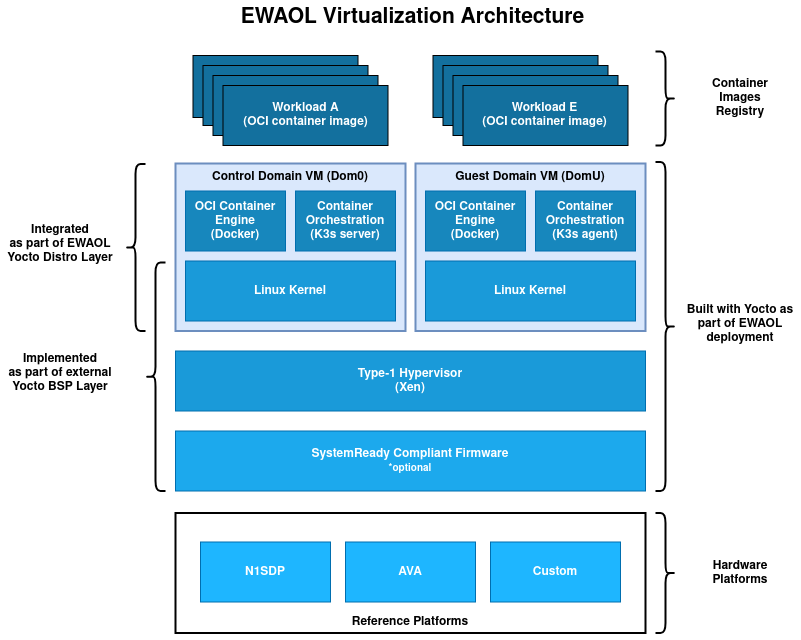

..
 # Copyright (c) 2022, Arm Limited.
 #
 # SPDX-License-Identifier: MIT

####################
System Architectures
####################

************
Introduction
************

This page describes the two target architectures supported by the EWAOL project.

**********************
Baremetal Architecture
**********************

.. image:: ../images/baremetal_architecture.png
   :align: center

An EWAOL baremetal distribution image (``ewaol-baremetal-image``) is enabled if
``ewaol-baremetal`` is included in ``DISTRO_FEATURES``. The image includes the
following image features by default:

  * Container engine and runtime with Docker and runc-opencontainers
  * Container workload orchestration with the K3s kubernetes distribution

On a baremetal distribution image system boot, a K3s Systemd service
(``k3s.service``) provides a container orchestration environment consisting of a
single K3s control plane and a single built-in K3s agent, communicating via the
local loopback network interface. This enables the orchestration and execution
of containerized application workloads on the baremetal distribution image,
operating as a single-node K3s cluster.

See :ref:`manual_build_system_baremetal_architecture` for details on building an
EWAOL baremetal distribution image.

***************************
Virtualization Architecture
***************************

An EWAOL virtualization distribution image (``ewaol-virtualization-image``) is
enabled if ``ewaol-virtualization`` is included in ``DISTRO_FEATURES``. The
image includes the following image features by default:

  * Hardware virtualization support with the Xen type-1 hypervisor
  * Container engine and runtime with Docker and runc-opencontainers
  * Container workload orchestration with the K3s kubernetes distribution

On an EWAOL virtualization distribution image, the software stack includes the
Xen type-1 hypervisor and provides a Control VM (Dom0) and a single bundled
Guest VM (DomU), by default. Virtualization support also includes Xen-related
configurations and necessary Xen-management packages into the Control VM root
filesystem.

The Control VM includes the ``xen-tools`` package along with network
configuration for the ``xenbr0`` bridge, to allow the Guest VM to access the
external network. By default, the bundled Guest VM image is based on the
``generic-arm64`` ``MACHINE``.

A Guest VM is included into the EWAOL virtualization distribution image via the
``ewaol-guest-vm-package`` recipe, with the Guest VM's rootfs stored as a raw
image file in ``*.qcow2`` format. In addition, this package includes a sample
Xen domain configuration file, which holds Xen-specific Guest VM settings as
detailed in `xl domain configuration`_. By default one Guest VM (with hostname
``ewaol-guest-vm1``) is built and included on the virtualization distribution
image.

See :ref:`manual_build_system_virtualization_architecture` for details on
building an EWAOL virtualization distribution image.

An EWAOL virtualization distribution image can be customized, including setting
the number of included Guest VMs. The supported virtualization-specific
customization parameters and how to set them are detailed at
:ref:`manual_build_system_virtualization_customization`.
