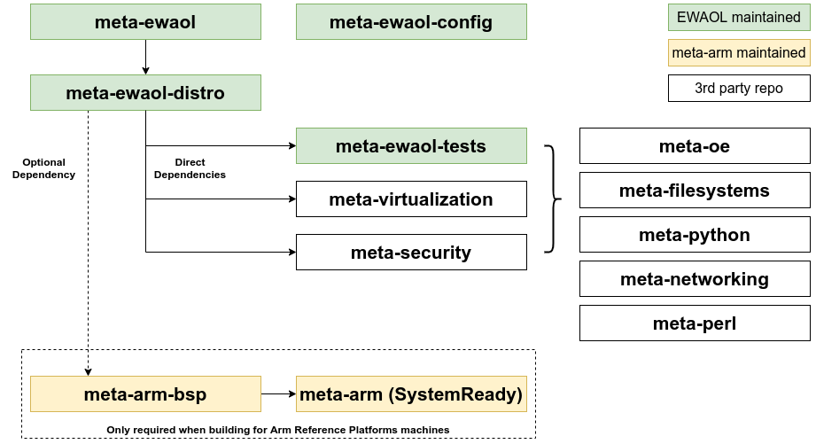

..
 # Copyright (c) 2021-2022, Arm Limited.
 #
 # SPDX-License-Identifier: MIT

############
Yocto Layers
############

The ``meta-ewaol`` repository provides three layers compatible with the Yocto
Project, in the following sub-directories:

  * ``meta-ewaol-distro``

    Yocto distribution layer providing top-level and general policies for the
    EWAOL distribution images.

  * ``meta-ewaol-tests``

    Yocto software layer with recipes that include run-time tests to validate
    EWAOL functionalities.

  * ``meta-ewaol-bsp``

    Yocto BSP layer with target platform specific extensions for particular
    EWAOL distribution images. Currently this layer extends the ``n1sdp``
    machine definition from the ``meta-arm-bsp`` layer for EWAOL virtualization
    distribution images. The ``meta-ewaol-bsp`` layer contains an additional
    grub configuration file with Xen boot entry and a custom kickstart
    ``ewaol-virtualization-n1sdp-efidisk.wks.in`` file. There is also a
    ``xen-devicetree.bb`` recipe, to generate a devicetree with extra modules
    nodes required by Xen to start the Control VM (Dom0). In addition, the Xen
    devicetree together with a Xen efi binary are included into the final wic
    image in the ``boot`` partition.

*************************
Layer Dependency Overview
*************************

The following diagram illustrates the layers which are integrated by the EWAOL
project, which are further expanded on below. |layer dependency statement|

EWAOL depends on the following layer dependency sources:

  .. code-block:: yaml
    :substitutions:

    URI: git://git.yoctoproject.org/poky
    layers: meta, meta-poky
    branch: |poky branch|
    revision: |poky revision|

    URI: git://git.openembedded.org/meta-openembedded
    layers: meta-filesystems, meta-networking, meta-oe, meta-python
    branch: |meta-openembedded branch|
    revision: |meta-openembedded branch|

    URI: git://git.yoctoproject.org/meta-virtualization
    layers: meta-virtualization
    branch: |meta-virtualization branch|
    revision: |meta-virtualization revision|

When building for the N1SDP hardware target platform, the following additional
layer dependency source is required:

  .. code-block:: yaml
    :substitutions:

    URI: git://git.yoctoproject.org/meta-arm
    layers: meta-arm, meta-arm-bsp, meta-arm-toolchain
    branch: |meta-arm branch|
    revision: |meta-arm revision|

The ``meta-arm`` repository provides:

  * ``meta-arm``:

    * URL: https://git.yoctoproject.org/cgit/cgit.cgi/meta-arm/tree/meta-arm.
    * Clean separation between Firmware and OS.
    * The canonical source for SystemReady firmware.

  * ``meta-arm-bsp``:

    * URL: https://git.yoctoproject.org/cgit/cgit.cgi/meta-arm/tree/meta-arm-bsp.
    * Board specific components for Arm target platforms.
    * Can be replaced by ``meta-<SiP>-bsp``.

  * ``meta-arm-toolchain``:

    * URL: https://git.yoctoproject.org/meta-arm/tree/meta-arm-toolchain.
    * Provides toolchain for Arm target platforms
