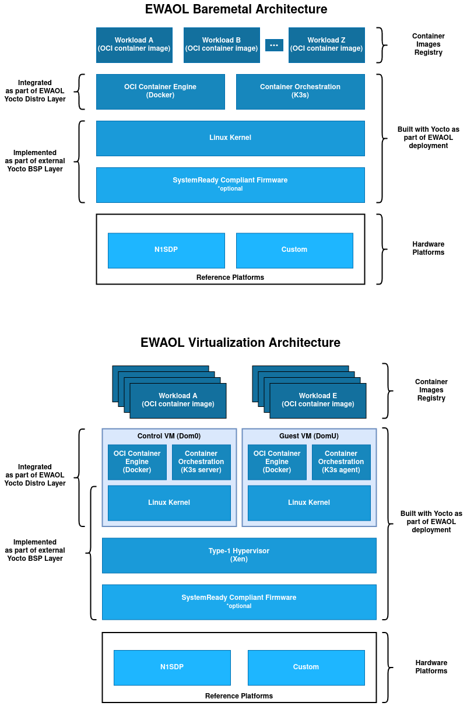

Overview
========

The Edge Workload Abstraction and Orchestration Layer (EWAOL) project provides
users with a standards based framework using containers for the deployment and
orchestration of applications on edge platforms.

Under this approach, a full software stack is divided into the following
software layers:

* **Workloads**: Applications deployed using containers. These are the workloads
  deployed on the EWAOL system. Note that the EWAOL project does not provide any
  workloads, and they should instead be deployed by the end-users according to
  their target use-cases.

* **Linux based Filesystem**: This is the main component provided by the EWAOL
  project. It contains tools and services that provide EWAOL core functionality
  such as the container engine and its run-time dependencies, the K3s container
  orchestration framework, and Xen virtualization management software, as well
  as optional packages such as those which provide EWAOL run-time integration
  tests or software development capabilities on the target platform.

* **System software**: Platform-specific software composed of firmware and
  operating system, as well as the Xen type-1 hypervisor when building an EWAOL
  virtualization image. EWAOL does not provide the system software but uses
  meta-arm, meta-arm-bsp, and meta-virtualization to provide an example
  reference stack using the N1SDP platform.

EWAOL is the reference implementation for SOAFEE (Scalable Open Architecture
For Embedded Edge), the Arm lead industry initiative for extending cloud-native
software development to automotive, with a special focus on real-time and
functional safety. For more details, please see `<http://soafee.io>`_.

More specifically, the ``meta-ewaol`` repository contains Yocto layers,
configuration files, and tools to support building and validating EWAOL
functionalities.

.. note::
    Users of this software stack must consider safety and security implications
    according to their own usage goals.

.. _overview_high-level_architecture:

High-Level Architecture
-----------------------

EWAOL supports two different architectures:

* **Baremetal** architecture, where the EWAOL software stack executes directly
  on the target hardware.
* **Virtualization** architecture, where the EWAOL software stack includes the
  Xen hypervisor and provides a Control VM (Dom0) and a single bundled Guest VM
  (DomU), by default.

The EWAOL images include the following major features:

  * Based on ``poky.conf`` distro
  * Systemd as init system
  * RPM as the package management system
  * Docker as container engine
  * runc-opencontainers as the OCI container runtime
  * Development and Test images flavors

Repository Structure
--------------------

The high-level structure of the ``meta-ewaol`` repository is as follows:

**meta-ewaol-distro**:
  Yocto layer that provides the top-level image recipes and general policies
  available to be implemented as a EWAOL project distribution.

**meta-ewaol-bsp**:
  Directory that contains machine specific configurations files necessary for
  some of the EWAOL images.

**meta-ewaol-config**:
  Directory that contains kas configurations files for building EWAOL images.

**meta-ewaol-tests**:
  Yocto layer that provides recipes and configuration to enable the validation
  of images built for the EWAOL project.

**documentation**:
  Directory that provides documentation for the ``meta-ewaol`` repository.

**tools**:
  Directory that provides tools that perform quality-assurance checks on the
  repository as well as tools and scripts to support EWAOL images builds.

.. _readme_layer_dependencies:

Layer Dependencies
-------------------

The repository contains Yocto layers that require dependencies as follows.

The ``meta-ewaol-distro`` layer depends on:

.. code-block:: yaml

    URI: git://git.yoctoproject.org/poky
    layers: meta, meta-poky
    branch: honister
    revision: HEAD

    URI: git://git.openembedded.org/meta-openembedded
    layers: meta-filesystems, meta-networking, meta-oe, meta-python
    branch: honister
    revision: HEAD

    URI: git://git.yoctoproject.org/meta-virtualization
    layers: meta-virtualization
    branch: honister
    revision: HEAD

The ``meta-ewaol-bsp`` layer depends on:

.. code-block:: yaml

    URI: git://git.yoctoproject.org/poky
    layers: meta
    branch: honister
    revision: HEAD

    URI: https://gitlab.arm.com/ewaol/meta-ewaol
    layers: meta-ewaol-distro
    branch: honister-dev
    revision: HEAD

The ``meta-ewaol-tests`` layer depends on:

.. code-block:: yaml

    URI: git://git.yoctoproject.org/poky
    layers: meta
    branch: honister
    revision: HEAD

Repository License
------------------

The software is provided under an MIT license (more details in
:ref:`license_link:License`).

Contributions to the project should follow the same license.

Contributions and Bug Reports
-----------------------------

This project has not put in place a process for contributions currently.

For bug reports, please submit an Issue via GitLab.

Feedback and support
--------------------

To request support please contact Arm at support@arm.com. Arm licensees may
also contact Arm via their partner managers.

Maintainer(s)
-------------

* Diego Sueiro <diego.sueiro@arm.com>
