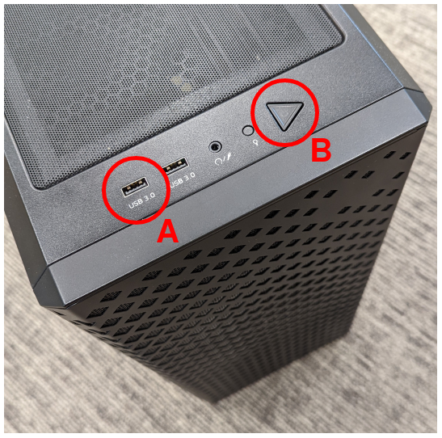
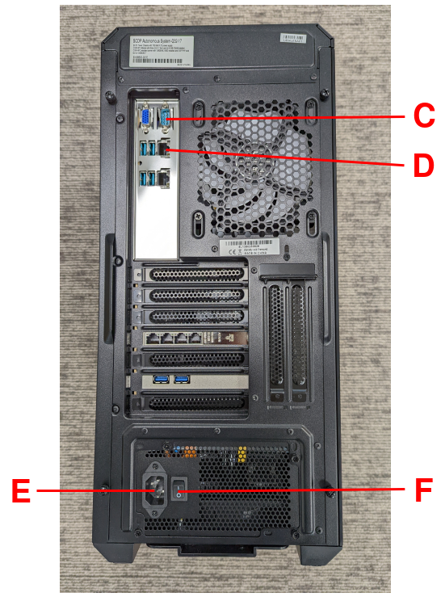

..
 # Copyright (c) 2022, Arm Limited.
 #
 # SPDX-License-Identifier: MIT

#########
Reproduce
#########

This section of the User Guide describes how to reproduce a standard EWAOL
distribution image for a supported
:ref:`target platform <manual_build_system_target_platforms>`, configuring and
deploying the supported set of distribution image features, and running simple
examples of the :ref:`EWAOL Use-Cases <introduction_use_cases_overview>`.

************
Introduction
************

The recommended approach for image build setup and customization is to use the
|kas build tool|_. To support this, EWAOL provides configuration files to setup
and build different target images, different distribution image features, and
set associated parameter configurations.

This page first briefly describes below the kas configuration files provided
with EWAOL, before guidance is given on using those kas configuration files to
set up the EWAOL distribution on a target platform.

.. note::
  All command examples on this page can be copied by clicking the copy button.
  Any console prompts at the start of each line, comments, or empty lines will
  be automatically excluded from the copied text.

The ``meta-ewaol-config/kas`` directory contains kas configuration files to
support building and customizing EWAOL distribution images via kas. These kas
configuration files contain default parameter settings for an EWAOL distribution
build, and are described in more detail in
:ref:`Build System <manual/build_system:Build System>`. Here, the files are
briefly introduced, classified into three ordered categories:

  * **Architecture Configs**: Set the target EWAOL architecture

    * ``baremetal.yml`` to prepare an image for the baremetal architecture.
    * ``virtualization.yml`` to prepare an image for the virtualization
      architecture.

  * **Build Modifier Configs**: Set and configure features of the EWAOL
    distribution

    * ``tests.yml`` to include run-time validation tests on the image.
    * ``baremetal-sdk.yml`` to build an SDK image for the baremetal
      architecture.
    * ``virtualization-sdk.yml`` to build an SDK image for the virtualization
      architecture.
    * ``security.yml`` to build a security-hardened EWAOL distribution image.
    * ``xen_pci_passthrough.yml`` to include the necessary configuration to
      enable support for Xen Guest VM PCI passthrough. The
      configuration provided in this Build Modifier Config will only take effect
      when building an EWAOL virtualization distribution image, and is currently
      only supported on the AVA Developer Platform.

  * **Target Platform Configs**: Set the target platform

    EWAOL currently supports two hardware target platforms, each with its own
    Target Platform Config:

    * ``n1sdp.yml`` to select the Neoverse N1 System Development Platform
      (N1SDP) as the target platform, corresponding to the ``n1sdp`` ``MACHINE``
      implemented in |meta-arm-bsp|_.

      See |N1SDP Technical Reference Manual|_ for more details about the N1SDP.
    * ``ava.yml`` to select the AVA Developer Platform (AVA) as the target
      platform, corresponding to the ``ava`` ``MACHINE`` implemented in
      |meta-adlink-ampere|_.

      See |AVA Developer Platform|_ for more details about AVA.

.. note::
  Additional information on EWAOL features such as run-time validation tests
  and the SDK can be found in the
  :ref:`Developer Manual <manual/index:Developer Manual>`

These kas configuration files can be used to build a custom EWAOL distribution
by passing one **Architecture Config**, zero or more **Build Modifier Configs**,
and one **Target Platform Config** to the kas build tool, chained via a colon
(:) character. Examples for this are given later in this document.

In the next section, guidance is provided for configuring, building and
deploying EWAOL distributions using these kas configuration files.

.. _user_guide_reproduce_environment_setup:

****************************
Build Host Environment Setup
****************************

This documentation assumes an Ubuntu-based Build Host, where the build steps
have been validated on the Ubuntu 18.04.6 LTS Linux distribution.

A number of package dependencies must be installed on the Build Host to run
build scenarios via the Yocto Project. The Yocto Project documentation
provides the |list of essential packages|_ together with a command for their
installation.

The recommended approach for building EWAOL is to use the kas build tool. To
install kas:

.. code-block:: console
  :substitutions:

  sudo -H pip3 install --upgrade kas==|kas version|

For more details on kas installation, see |kas Dependencies & installation|_.

To deploy an EWAOL distribution image onto the supported target platform, this
User Guide uses ``bmap-tools``. This can be installed via:

.. code-block:: console

   sudo apt install bmap-tools

.. note::
  The Build Host should have at least 65 GBytes of free disk space to build an
  EWAOL baremetal distribution image, or at least 100 GBytes of free disk space
  to build an EWAOL virtualization distribution image.

.. _user_guide_reproduce_download:

********
Download
********

The ``meta-ewaol`` repository can be downloaded using Git, via:

.. code-block:: shell
  :substitutions:

  # Change the tag or branch to be fetched by replacing the value supplied to
  # the --branch parameter option

  mkdir -p ~/ewaol
  cd ~/ewaol
  git clone |meta-ewaol remote| --branch |meta-ewaol branch|
  cd meta-ewaol

.. _user_guide_reproduce_build:

*****
Build
*****

The provided kas configuration files can be combined to build and EWAOL
distribution image for different target platforms, for different EWAOL system
architectures, and to apply different sets of customizable parameters.
Therefore, the following build guidance is provided as a set of alternatives
to target each of the main supported use cases.

Alternatives are distinguished first by EWAOL system architecture as distinct
sections, then by hardware target platform or distribution image feature, with
each alternative denoted alphabetically (e.g., A, B, ...).

Baremetal Distribution
======================

To build a baremetal distribution image:

  A. For the N1SDP hardware target platform:

    .. code-block:: console

      kas build --update meta-ewaol-config/kas/baremetal.yml:meta-ewaol-config/kas/n1sdp.yml

    The resulting baremetal distribution image will be produced at:
    ``build/tmp_baremetal/deploy/images/n1sdp/ewaol-baremetal-image-n1sdp.*``

  B. For the AVA hardware target platform:

    .. code-block:: console

      kas build --update meta-ewaol-config/kas/baremetal.yml:meta-ewaol-config/kas/ava.yml

    The resulting baremetal distribution image will be produced at:
    ``build/tmp_baremetal/deploy/images/ava/ewaol-baremetal-image-ava.*``

To build a baremetal distribution image with the EWAOL SDK:

  C. For the N1SDP hardware target platform:

    .. code-block:: console

      kas build --update meta-ewaol-config/kas/baremetal-sdk.yml:meta-ewaol-config/kas/n1sdp.yml

    The resulting baremetal distribution image which includes the EWAOL SDK will
    be produced at:
    ``build/tmp_baremetal/deploy/images/n1sdp/ewaol-baremetal-sdk-image-n1sdp.*``

  D. For the AVA hardware target platform:

    .. code-block:: console

      kas build --update meta-ewaol-config/kas/baremetal-sdk.yml:meta-ewaol-config/kas/ava.yml

    The resulting baremetal distribution image which includes the EWAOL SDK will
    be produced at:
    ``build/tmp_baremetal/deploy/images/ava/ewaol-baremetal-sdk-image-ava.*``

EWAOL baremetal distribution images can be modified by adding run-time
validation tests and security hardening to the distribution. This can be done
by including ``meta-ewaol-config/kas/tests.yml`` and
``meta-ewaol-config/kas/security.yml`` kas configuration file as a Build
Modifier.
See :ref:`manual_build_system_run_time_integration_tests` for more details on
including run-time validation tests and
:ref:`manual_build_system_security_hardening` for more details on security
hardening.

Virtualization Distribution
===========================

To build a virtualization distribution image:

  A. For the N1SDP hardware target platform:

    .. code-block:: console

      kas build --update meta-ewaol-config/kas/virtualization.yml:meta-ewaol-config/kas/n1sdp.yml

    The resulting virtualization distribution image will be produced:
    ``build/tmp_virtualization/deploy/images/n1sdp/ewaol-virtualization-image-n1sdp.*``

  B. For the AVA hardware target platform:

    .. code-block:: console

      kas build --update meta-ewaol-config/kas/virtualization.yml:meta-ewaol-config/kas/ava.yml

    The resulting virtualization distribution image will be produced:
    ``build/tmp_virtualization/deploy/images/ava/ewaol-virtualization-image-ava.*``

To build a virtualization distribution image with the EWAOL SDK:

  C. For the N1SDP hardware target platform:

    .. code-block:: console

      kas build --update meta-ewaol-config/kas/virtualization-sdk.yml:meta-ewaol-config/kas/n1sdp.yml

    The resulting virtualization distribution image which includes the EWAOL SDK
    will be produced at:
    ``build/tmp_virtualization/deploy/images/n1sdp/ewaol-virtualization-sdk-image-n1sdp.*``

  D. For the AVA hardware target platform:

    .. code-block:: console

      kas build --update meta-ewaol-config/kas/virtualization-sdk.yml:meta-ewaol-config/kas/ava.yml

    The resulting virtualization distribution image which includes the EWAOL SDK
    will be produced at:
    ``build/tmp_virtualization/deploy/images/ava/ewaol-virtualization-sdk-image-ava.*``

As with the EWAOL baremetal guidance above, EWAOL virtualization distribution
images can also be modified to include run-time validation tests and security
hardening by adding ``meta-ewaol-config/kas/tests.yml`` and
``meta-ewaol-config/kas/security.yml`` kas configuration files respectively. In
addition, an EWAOL virtualization distribution image built for the AVA Developer
Platform can be customized so that Guest VMs may be assigned an exclusive PCI
device via Xen PCI passthrough capability, added via the
``meta-ewaol-config/kas/xen_pci_passthrough.yml`` kas configuration file.
See :ref:`manual_build_system_run_time_integration_tests` for more details on
including run-time validation tests,
:ref:`manual_build_system_security_hardening` for more details on security
hardening, and :ref:`manual_build_system_pci_passthrough` for more details on
PCI passthrough configuration.

Customization
-------------

EWAOL defines a set of standard customizable environment variables for
configuring the VMs included on a virtualization distribution image. The
following list shows the variables and their default values (where ``MB`` and
``KB`` refer to Megabytes and Kilobytes, respectively), when including one Guest
VM instance:

  .. code-block:: yaml
    :substitutions:

    |virtualization customization yaml|

To customize these standard variables, set their value in the environment for
the kas build. For example, to build a virtualization distribution image for the
N1SDP using the above default values, but allocating a non-default value of
eight CPUs for its Guest VM, run:

  .. code-block:: console

    EWAOL_GUEST_VM1_NUMBER_OF_CPUS=8 kas build --update meta-ewaol-config/kas/virtualization.yml:meta-ewaol-config/kas/n1sdp.yml

An additional non-default environment variable is available for each Guest VM,
which can be used to assign the Guest VM exclusive use of a single PCI device.
Using this environment variable requires that the Xen PCI passthrough capability
is enabled. Details for enabling this capability is provided at
:ref:`manual_build_system_pci_passthrough`. This will provide a corresponding
environment variable for each Guest VM, such as the following variable and its
default value for the first Guest VM:

  .. code-block:: yaml

    EWAOL_GUEST_VM1_PCI_PASSTHROUGH_DEVICE: "0000:01:00.0"         # PCI device ID to be assigned

EWAOL supports adding multiple independently-configurable Guest VMs to a
virtualization distribution image. Additional details for this are provided at
:ref:`manual_build_system_virtualization_customization`.

.. _user_guide_reproduce_deploy:

******
Deploy
******

This section provides instructions for deploying an EWAOL distribution image on
the support hardware target platforms:

  * :ref:`EWAOL distribution image deployment on N1SDP<user_guide_reproduce_deploy_n1sdp>`
  * :ref:`EWAOL distribution image deployment on AVA<user_guide_reproduce_deploy_ava>`

.. note::
  As the image filenames vary depending on the architecture and the inclusion of
  the SDK, the precise commands to deploy an EWAOL distribution image vary. The
  following documentation denotes required instructions with sequentially
  numbered indexes (e.g., 1, 2, ...), and distinguishes alternative instructions
  by denoting the alternatives alphabetically (e.g., A, B, ...).

The deployment guidance requires a physical connection able to be established
between the hardware target platform and a PC that can be used to interface with
it. For simplicity, this PC is assumed to be the Build Host.

.. _user_guide_reproduce_deploy_n1sdp:

N1SDP
=====

Instructions for deploying an EWAOL distribution image on the N1SDP hardware
target platform are divided into two parts:

  * `Load the Image onto a USB Storage Device`_
  * `Update the N1SDP MCC Configuration MicroSD Card`_

Load the Image onto a USB Storage Device
----------------------------------------

EWAOL distribution images are produced as files with the ``.wic.bmap`` and
``.wic.gz`` extensions. They must first be loaded to a USB storage device, as
follows:

1. Prepare a USB storage device (minimum size of 64 GB).

  Identify the USB storage device using ``lsblk`` command:

  .. code-block:: shell

    lsblk

  This will output, for example:

  .. code-block:: console

    NAME   MAJ:MIN RM   SIZE RO TYPE MOUNTPOINT
    sdc      8:0    0    64G  0 disk
    ...

.. warning::
  In this example, the USB storage device is the ``/dev/sdc`` device. As this
  may vary on different machines, care should be taken when copying and pasting
  the following commands.

2. Prepare for the image copy:

  A. Baremetal

    .. code-block:: console

      sudo umount /dev/sdc*
      cd build/tmp_baremetal/deploy/images/n1sdp/

  B. Virtualization

    .. code-block:: console

      sudo umount /dev/sdc*
      cd build/tmp_virtualization/deploy/images/n1sdp/

.. warning::
  The next step will result in all prior partitions and data on the USB storage
  device being erased. Please backup before continuing.

3. Flash the image onto the USB storage device using ``bmap-tools``:

  A. Baremetal distribution image:

    .. code-block:: console

      sudo bmaptool copy --bmap ewaol-baremetal-image-n1sdp.wic.bmap ewaol-baremetal-image-n1sdp.wic.gz /dev/sdc

  B. Baremetal-SDK distribution image:

    .. code-block:: console

      sudo bmaptool copy --bmap ewaol-baremetal-sdk-image-n1sdp.wic.bmap ewaol-baremetal-sdk-image-n1sdp.wic.gz /dev/sdc

  C. Virtualization distribution image:

    .. code-block:: console

      sudo bmaptool copy --bmap ewaol-virtualization-image-n1sdp.wic.bmap ewaol-virtualization-image-n1sdp.wic.gz /dev/sdc

  D. Virtualization-SDK distribution image:

    .. code-block:: console

      sudo bmaptool copy --bmap ewaol-virtualization-sdk-image-n1sdp.wic.bmap ewaol-virtualization-sdk-image-n1sdp.wic.gz /dev/sdc

The USB storage device can then be safely ejected from the Build Host, and
plugged into one of the USB 3.0 ports on the N1SDP.

Update the N1SDP MCC Configuration MicroSD Card
-----------------------------------------------

.. note::
  This process doesn't need to be performed every time the USB Storage Device
  gets updated. It is only necessary to update the MCC configuration microSD
  card when the EWAOL major version changes.

The instructions are as follows:

1. Connect a USB-B cable between the Build Host and the DBG USB port of the
   N1SDP back panel.

2. Find four TTY USB devices in the ``/dev`` directory of the Build Host, via:

  .. code-block:: shell

    ls /dev/ttyUSB*

  This will output, for example:

  .. code-block:: console

    /dev/ttyUSB0
    /dev/ttyUSB1
    /dev/ttyUSB2
    /dev/ttyUSB3

  By default the four ports are connected to the following devices:

    - ttyUSB<n> Motherboard Configuration Controller (MCC)
    - ttyUSB<n+1> Application processor (AP)
    - ttyUSB<n+2> System Control Processor (SCP)
    - ttyUSB<n+3> Manageability Control Processor (MCP)

  In this guide the ports are:

    - ttyUSB0: MCC
    - ttyUSB1: AP
    - ttyUSB2: SCP
    - ttyUSB3: MCP

  The ports are configured with the following settings:

    - 115200 Baud
    - 8N1
    - No hardware or software flow support

3. Connect to the N1SDP's MCC console. Any terminal applications such as
   ``putty``, ``screen`` or ``minicom``  will work. The  ``screen`` utility is
   used in the following command:

  .. code-block:: shell

    sudo screen /dev/ttyUSB0 115200

4. Power-on the N1SDP via the power supply switch on the N1SDP tower. The MCC
   window will be shown. Type the following command at the ``Cmd>`` prompt to
   see MCC firmware version and a list of commands:

  .. code-block:: console

    ?

  This will output, for example:

  .. code-block:: console

    Arm N1SDP MCC Firmware v1.0.1
    Build Date: Sep  5 2019
    Build Time: 14:18:16
    + command ------------------+ function ---------------------------------+
    | CAP "fname" [/A]          | captures serial data to a file            |
    |                           |  [/A option appends data to a file]       |
    | FILL "fname" [nnnn]       | create a file filled with text            |
    |                           |  [nnnn - number of lines, default=1000]   |
    | TYPE "fname"              | displays the content of a text file       |
    | REN "fname1" "fname2"     | renames a file 'fname1' to 'fname2'       |
    | COPY "fin" ["fin2"] "fout"| copies a file 'fin' to 'fout' file        |
    |                           |  ['fin2' option merges 'fin' and 'fin2']  |
    | DEL "fname"               | deletes a file                            |
    | DIR "[mask]"              | displays a list of files in the directory |
    | FORMAT [label]            | formats Flash Memory Card                 |
    | USB_ON                    | Enable usb                                |
    | USB_OFF                   | Disable usb                               |
    | SHUTDOWN                  | Shutdown PSU (leave micro running)        |
    | REBOOT                    | Power cycle system and reboot             |
    | RESET                     | Reset Board using CB_nRST                 |
    | DEBUG                     | Enters debug menu                         |
    | EEPROM                    | Enters eeprom menu                        |
    | HELP  or  ?               | displays this help                        |
    |                                                                       |
    | THE FOLLOWING COMMANDS ARE ONLY AVAILABLE IN RUN MODE                 |
    |                                                                       |
    | CASE_FAN_SPEED "SPEED"    | Choose from SLOW, MEDIUM, FAST            |
    | READ_AXI "fname"          | Read system memory to file 'fname'        |
    |          "address"        | from address to end address               |
    |          "end_address"    |                                           |
    | WRITE_AXI "fname"         | Write file 'fname' to system memory       |
    |           "address"       | at address                                |
    +---------------------------+-------------------------------------------+

5. In the MCC window at the ``Cmd>`` prompt, enable USB via:

  .. code-block:: console

    USB_ON

6. Mount the N1SDP's internal microSD card over the DBG USB connection to the
   Build Host and copy the required files.

  The microSD card is visible on the Build Host as a disk device after issuing
  the ``USB_ON`` command in the MCC console, as performed in the previous step.
  This can be found using the ``lsblk`` command:

  .. code-block:: shell

    lsblk

  This will output, for example:

  .. code-block:: console

    NAME   MAJ:MIN RM   SIZE RO TYPE MOUNTPOINT
    sdb      8:0    0     2G  0 disk
    └─sdb1   8:1    0     2G  0 part

  .. warning::
    In this example, the ``/dev/sdb1`` partition is being mounted. As this
    may vary on different machines, care should be taken when copying and
    pasting the following commands.

  Mount the device and check its contents:

  .. code-block:: console

    sudo umount /dev/sdb1
    sudo mkdir -p /tmp/sdcard
    sudo mount /dev/sdb1 /tmp/sdcard
    ls /tmp/sdcard

  This should output, for example:

  .. code-block:: console

    config.txt   ee0316a.txt   LICENSES   LOG.TXT   MB   SOFTWARE

7. Wipe the mounted microSD card, then extract the contents of
   ``n1sdp-board-firmware_primary.tar.gz`` onto it:

  A. Baremetal

    .. code-block:: console

      sudo rm -rf /tmp/sdcard/*
      sudo tar --no-same-owner -xf \
        build/tmp_baremetal/deploy/images/n1sdp/n1sdp-board-firmware_primary.tar.gz -C \
        /tmp/sdcard/ && sync
      sudo umount /tmp/sdcard
      sudo rmdir /tmp/sdcard

  B. Virtualization

    .. code-block:: console

      sudo rm -rf /tmp/sdcard/*
      sudo tar --no-same-owner -xf \
        build/tmp_virtualization/deploy/images/n1sdp/n1sdp-board-firmware_primary.tar.gz -C \
        /tmp/sdcard/ && sync
      sudo umount /tmp/sdcard
      sudo rmdir /tmp/sdcard

  .. note::
    If the N1SDP board was manufactured after November 2019 (Serial Number
    greater than ``36253xxx``), a different PMIC firmware image must be used to
    prevent potential damage to the board. More details can be found in
    `Potential firmware damage notice`_. The ``MB/HBI0316A/io_v123f.txt`` file
    located in the microSD needs to be updated. To update it, set the PMIC image
    (``300k_8c2.bin``) to be used in the newer models by running the following
    commands on the Build Host:

    .. code-block:: console

      sudo umount /dev/sdb1
      sudo mkdir -p /tmp/sdcard
      sudo mount /dev/sdb1 /tmp/sdcard
      sudo sed -i '/^MBPMIC: pms_0V85.bin/s/^/;/g' /tmp/sdcard/MB/HBI0316A/io_v123f.txt
      sudo sed -i '/^;MBPMIC: 300k_8c2.bin/s/^;//g' /tmp/sdcard/MB/HBI0316A/io_v123f.txt
      sudo umount /tmp/sdcard
      sudo rmdir /tmp/sdcard

To run the deployed EWAOL distribution image, simply reboot the target platform
by running the following command on the MCC console:

  .. code-block:: console

    REBOOT

Once the reboot has occurred, the EWAOL distribution boot process should then be
output to the MCC console. After the boot process has completed, the EWAOL
log-in prompt should appear and the distribution has been successfully deployed.

.. _user_guide_reproduce_deploy_ava:

AVA
===

.. note::
  To use the AVA Developer Platform, please make sure the latest available
  firmware is installed. See the ADLINK's
  |AVA Developer Platform documentation|_ for guidance and support on installing
  the latest firmware. The following instructions and supporting images were
  created using Tianocore/EDK2 version ``1.07.300.02b Build 20220302``.

Instructions for deploying an EWAOL distribution image on the AVA hardware
target platform are divided into three parts:

  1. :ref:`Load the AVA Flasher Image onto a USB Storage Device<user_guide_reproduce_ava_deploy_flasher_to_usb>`
  2. :ref:`Boot AVA into the Flasher Image Loaded on the USB Storage Device<user_guide_reproduce_ava_deploy_boot_flasher>`
  3. :ref:`Flash the EWAOL Distribution Image onto the AVA NVMe M.2 Storage Device<user_guide_reproduce_ava_deploy_flash_ewaol>`

The following two images, with reference labels given in red, are provided to
support these instructions:

|

.. _user_guide_reproduce_ava_images:

|

.. _user_guide_reproduce_ava_deploy_flasher_to_usb:

1. Load the AVA Flasher Image onto a USB Storage Device
-------------------------------------------------------

First, it is necessary to use the Build Host to load AVA's bootable 'Flasher
Image' onto a USB storage device. This will later be connected to the AVA
Developer Platform and used to boot the machine. The steps to do this are as
follows:

1. **On the Build Host:** run the following commands to download and unpack the
   AVA Flasher Image from ADLINK's |AVA Developer Platform Downloads Page|_ into
   an appropriate storage directory, here created as ``~/ava_flasher_image``:

   .. code-block:: shell

     mkdir -p ~/ava_flasher_image && cd ~/ava_flasher_image
     wget https://hq0epm0west0us0storage.blob.core.windows.net/%24web/public/COMe/Ampere/AVA/Images/Yocto/adlink-flasher-image-ava.tar.xz
     tar -xJf adlink-flasher-image-ava.tar.xz && cd adlink-flasher-image-ava

2. **On the Build Host:** connect a USB storage device (minimum size of 64 GB)
   and identify it using the ``lsblk`` command:

   .. code-block:: shell

     lsblk

   This will output, for example:

   .. code-block:: console

     NAME   MAJ:MIN RM   SIZE RO TYPE MOUNTPOINT
     sdc      8:0    0    64G  0 disk
     ...

.. warning::
  In this example, the USB storage device is the ``/dev/sdc`` device. As this
  may vary on different machines, care should be taken when copying and pasting
  the following commands.

3. **On the Build Host:** prepare for the Flasher Image copy:

   .. code-block:: console

     sudo umount /dev/sdc*
     cd ~/ava_flasher_image

.. warning::
  The next step will result in all prior partitions and data on the USB storage
  device being erased. Please backup before continuing.

3. **On the Build Host:** transfer the Flasher Image onto the USB storage device
   using the ``bmaptool`` utility:

   .. code-block:: console

     sudo bmaptool copy --bmap adlink-flasher-image-ava.wic.bmap adlink-flasher-image-ava.wic.gz /dev/sdc

4. Safely eject the USB storage device from the Build Host.

.. _user_guide_reproduce_ava_deploy_boot_flasher:

2. Boot AVA into the Flasher Image Loaded on the USB Storage Device
-------------------------------------------------------------------

Next, prepare the AVA Developer Platform as follows.

5. Connect a USB to RS232 female DB9 serial converter cable between the Build
   Host and the ``Serial Console`` port on the AVA back-panel, marked ``C`` in
   the :ref:`reference images<user_guide_reproduce_ava_images>`.

6. Connect the AVA Developer Platform to the network via the ``GbE System (In
   Band)`` ethernet port, marked ``D`` in the
   :ref:`reference images<user_guide_reproduce_ava_images>`.

7. Provide power to the AVA Developer Platform via a C13 mains power cable
   connected to the ``Power Input`` port, marked ``E`` in the
   :ref:`reference images<user_guide_reproduce_ava_images>`.

8. Switch the AVA Developer Platform's ``Power Main Switch`` on, marked ``F`` in
   the :ref:`reference images<user_guide_reproduce_ava_images>`.

9. Connect the USB storage device containing the AVA Flasher Image to the AVA
   Developer Platform using a USB 3.0 port, marked ``A`` in the
   :ref:`reference images<user_guide_reproduce_ava_images>`.

Then, set up the Build Host to access the AVA Developer Platform via a serial
console:

10. **On the Build Host:** find the TTY USB device in the ``/dev`` directory
    that corresponds to the serial connection from the Build Host to the AVA
    Developer Platform that was set up in step 5, via:

    .. code-block:: shell

      ls /dev/ttyUSB*

    In this example, the corresponding TTY USB device is assumed to be
    ``/dev/ttyUSB0``.

    The port should be configured with the following settings:

      - 115200 Baud
      - 8N1
      - No hardware or software flow support

11. **On the Build Host:** set up a terminal to interface with the AVA Developer
    Platform's serial console. This terminal will be referred to as the 'Serial
    Console Terminal'. Any terminal applications such as ``putty``, ``screen``
    or ``minicom``  will work. The  ``screen`` utility is used in the following
    command:

    .. code-block:: shell

      sudo screen /dev/ttyUSB0 115200

12. Power-on the AVA Developer Platform via the power button, marked ``B`` in
    the :ref:`reference images<user_guide_reproduce_ava_images>`.

    The Serial Console Terminal should then start receiving output from the AVA
    boot process.

13. **On the Serial Console Terminal:** interrupt the boot process to access
    the boot options menu, by entering ``ESCAPE`` at the prompt (by pressing
    the ESC key once on the keyboard) shown in the following image:

    .. image:: ../images/ava_edk2_escape_boot_screenshot.png
       :align: center

|
    This should provide access to the EDK2 interface shown in the following
    image:

    .. image:: ../images/ava_edk2_initial_boot_screenshot.png
       :align: center

|

14. **On the Serial Console Terminal:** move to the ``Boot Manager`` entry using
the arrow keys, and select it by pressing the ``ENTER`` key:

    .. image:: ../images/ava_edk2_boot_manager_boot_screenshot.png
       :align: center

|

15. **On the Serial Console Terminal:** the connected USB storage device
    containing the AVA Flasher Image should then be visible in the ``Boot
    Manager Menu``. Highlight that USB storage device entry using the arrow keys
    and select it by pressing the ``ENTER`` key. An example ``Boot Manager
    Menu`` showing a connected USB storage device is shown in the following
    image:

    .. image:: ../images/ava_edk2_boot_usb_boot_screenshot.png
       :align: center

|

16. **On the Serial Console Terminal:** a GRUB2 boot menu will appear as shown
    in the following image:

    .. image:: ../images/ava_grub2_flasher_image_usb_boot_screenshot.png
       :align: center

|
    Either select the highlighted entry, or wait for it to be selected
    automatically.

Output from the AVA Flasher Image boot process should then appear on the Serial
Console Terminal, and this process should result in a Linux console, with no
manual account log-in required, such as the following:

    .. code-block:: console

      Poky (Yocto Project Reference Distro) 4.0.1 ava ttyAMA0

      ava login: root (automatic login)

      root@ava:~#

.. _user_guide_reproduce_ava_deploy_flash_ewaol:

3. Flash the EWAOL Distribution Image onto the AVA NVMe M.2 Storage Device
--------------------------------------------------------------------------

To flash the EWAOL distribution image onto the AVA's persistent storage, it must
first be transferred to the USB storage device which is running the AVA Flasher
Image on the AVA Developer Platform. The steps for doing this are as follows:

17. **On the Build Host:** create or swap to a **different** terminal from that
    used for the Serial Console Terminal, such as the one that was used to
    execute the ``kas build`` commands during the
    :ref:`build instructions<user_guide_reproduce_build>` described previously.
    This terminal will be referred to as the 'Build Host Terminal'.

18. **On the Build Host Terminal:** change the working directory to the
    directory which contains the Yocto build folder (here assumed to be
    the root directory of the cloned ``meta-ewaol`` repository), and prepare
    for the EWAOL distribution image copy:

    A. Baremetal

      .. code-block:: console

        cd build/tmp_baremetal/deploy/images/ava/

    B. Virtualization

      .. code-block:: console

        cd build/tmp_virtualization/deploy/images/ava/

19. **On the Serial Console Terminal:** determine the IP address associated with
    the AVA Flasher Image running on the AVA Developer Platform, by running the
    following command:

    .. code-block:: console

      ifconfig eth0 | grep "inet addr"

    Running this command will output, for example:

    .. code-block:: console

      inet addr:[IP]  Bcast:10.1.195.255  Mask:255.255.254.0

    The relevant IP address to extract is denoted ``[IP]`` in this example
    output, which is also used to the reference the IP address in the next step.

20. **On the Serial Console Terminal:** define an environment variable to hold
    the IP address and allow copy-pasting of the following commands, by running:

    .. code-block:: console

      export TARGET_IP=[IP]

    Be sure to replace ``[IP]`` in this command with the IP address determined
    in the previous step.

21. **On the Build Host Terminal:** transfer the EWAOL distribution image to the
    AVA Developer Platform using the ``scp`` utility. The command to run depends
    on the target EWAOL distribution image:

    A. Baremetal distribution image:

      .. code-block:: console

        scp ewaol-baremetal-image-ava.wic.* root${TARGET_IP}:/tmp/

    B. Baremetal-SDK distribution image:

      .. code-block:: console

        scp ewaol-baremetal-sdk-image-ava.wic.* root@${TARGET_IP}:/tmp/

    C. Virtualization distribution image:

      .. code-block:: console

        scp ewaol-virtualization-image-ava.wic.* root@${TARGET_IP}:/tmp/

    D. Virtualization-SDK distribution image:

      .. code-block:: console

        scp ewaol-virtualization-sdk-image-ava.wic.* root@${TARGET_IP}:/tmp/

22. **On the Serial Console Terminal:** once the file transfer has completed,
    flash the EWAOL distribution image to the AVA NVMe M.2 storage device using
    the ``bmaptool`` utility.

    .. note::
      This guidance assumes that the AVA Developer Platform storage drives and
      partitions have not been modified, and no additional storage devices have
      been connected other than those described in these instructions. The AVA
      NVMe M.2 storage device therefore corresponds to the ``/dev/nvme0n1``
      device.

    .. warning::
      The next step will result in all prior partitions and data on the AVA NVMe
      M.2 storage device to be erased.

    A. Baremetal distribution image:

      .. code-block:: console

        bmaptool copy --bmap /tmp/ewaol-baremetal-image-ava.wic.bmap /tmp/ewaol-baremetal-image-ava.wic.gz /dev/nvme0n1

    B. Baremetal-SDK distribution image:

      .. code-block:: console

        bmaptool copy --bmap /tmp/ewaol-baremetal-sdk-image-ava.wic.bmap /tmp/ewaol-baremetal-sdk-image-ava.wic.gz /dev/nvme0n1

    C. Virtualization distribution image:

      .. code-block:: console

        bmaptool copy --bmap /tmp/ewaol-virtualization-image-ava.wic.bmap /tmp/ewaol-virtualization-image-ava.wic.gz /dev/nvme0n1

    D. Virtualization-SDK distribution image:

      .. code-block:: console

        bmaptool copy --bmap /tmp/ewaol-virtualization-sdk-image-ava.wic.bmap /tmp/ewaol-virtualization-sdk-image-ava.wic.gz /dev/nvme0n1

23. On the Serial Console Terminal: once the ``bmaptool`` process has complete,
    power-off the AVA Developer Platform by running:

    .. code-block:: console

      poweroff

24. Remove the USB storage device containing the AVA Flasher Image from the AVA
    Developer Platform.

25. Power-on the AVA Developer Platform via the power button, marked ``B`` in
    the :ref:`reference images<user_guide_reproduce_ava_images>`.

The EWAOL distribution boot process should then be output to the Serial Console
Terminal. After the boot process has completed, the EWAOL log-in prompt should
appear and the distribution has been successfully deployed.

***
Run
***

The EWAOL distribution image can be logged into as ``ewaol`` user.  See
:ref:`User Accounts<manual/user_accounts:User Accounts>` for more information
about user accounts and groups.

On an EWAOL virtualization distribution image, this will access the Control VM.
To log into a Guest VM, the ``xl`` tool can be used. For example, on a default
EWAOL virtualization distribution image:

  .. code-block:: console

    sudo xl console ewaol-guest-vm1

This command will provide a console on the Guest VM, which can be exited by
entering ``Ctrl+]``. See the |xl documentation|_ for further details.

The distribution can then be used for deployment and orchestration of
application workloads in order to achieve the desired use-cases.

********
Validate
********

As an initial validation step, check that the appropriate Systemd services are
running successfully, depending on the target architecture:

  * Baremetal Architecture:

    * ``docker.service``
    * ``k3s.service``

    These services can be checked by running the command:

      .. code-block:: console

        systemctl status --no-pager --lines=0 docker.service k3s.service

    And ensuring the command output lists them as active and running.

  * Virtualization Architecture:

    * ``docker.service``
    * ``k3s.service``
    * ``xendomains.service``

    These services can be checked by running the command:

      .. code-block:: console

        systemctl status --no-pager --lines=0 docker.service k3s.service xendomains.service

    And ensuring the command output lists them as active and running.

More thorough run-time validation of EWAOL components are provided as a series
of integration tests, available if the ``meta-ewaol-config/kas/tests.yml`` kas
configuration file was included in the image build. These are detailed at
:ref:`validation_run-time_integration_tests`.

The integration tests that this command will execute are detailed in
:ref:`Validation <manual/validation:Validation>`, along with the expected
format of the test output and additional details for running and customizing
the validation.

*******************************
Reproducing the EWAOL Use-Cases
*******************************

With the EWAOL distribution running and validated, it can be used to achieve the
target :ref:`EWAOL Use-Cases <introduction_use_cases_overview>`.

This section briefly demonstrates simplified use-case examples, where detailed
instructions for developing, deploying, and orchestrating application workloads
are left to the external documentation of the relevant technology, as stated in
the :ref:`introduction_documentation_assumptions`.

.. note::
  The following example instructions form similar but simplified versions of the
  activities carried out by the run-time validation tests that can be included
  on the EWAOL distribution. See
  :ref:`Validation <manual/validation:Validation>` and the test implementations
  for further demonstrations of EWAOL use-cases.

Deploying Application Workloads via Docker and K3s
==================================================

This example use-case is performed on the:

  * Baremetal distribution image
  * Virtualization distribution image

This example deploys the |Nginx|_ webserver as an application workload, using
the ``nginx`` container image available from Docker's default image repository.
The deployment can be achieved either via Docker or via K3s, as follows:

  1. Reboot the image and log-in as the ``ewaol`` user.

     On a virtualization distribution image, this will produce a console on the
     Control VM.

  2. Deploy the example application workload:

     * **Deploy via Docker**

       2.1. Run the following example command to deploy via Docker:

            .. code-block:: console

              sudo docker run --name nginx_docker_example -p 8082:80 -d nginx

       2.2. Confirm the Docker container is running by checking its ``STATUS``
       in the container list:

            .. code-block:: console

              sudo docker container list

            The container should appear in the list of running containers, with
            the associated name ``nginx_docker_example``. For example:

            .. code-block:: console

              CONTAINER ID   IMAGE     COMMAND                  CREATED          STATUS          PORTS                                   NAMES
              cb7f67053556   nginx     "/docker-entrypoint.…"   14 seconds ago   Up 13 seconds   0.0.0.0:8082->80/tcp, :::8082->80/tcp   nginx_docker_example

     * **Deploy via K3s**

       2.1. Run the following example command to deploy via K3s:

            .. code-block:: console

              cat << EOT > nginx-example.yml && sudo kubectl apply -f nginx-example.yml
              apiVersion: v1
              kind: Pod
              metadata:
                name: k3s-nginx-example
              spec:
                containers:
                - name: nginx
                  image: nginx
                  ports:
                  - containerPort: 80
                    hostPort: 8082
              EOT

       2.2. Confirm that the K3s Pod hosting the container is running by
       checking that its ``STATUS`` is ``running``, using:

            .. code-block:: console

              sudo kubectl get pods -o wide

            The output should be similar to the following example output, which
            was captured on the N1SDP:

            .. code-block:: console

              NAME                READY   STATUS    RESTARTS   AGE   IP          NODE    NOMINATED NODE   READINESS GATES
              k3s-nginx-example   1/1     Running   0          28s   [IP]   n1sdp   <none>           <none>

  3. After the Nginx application workload has been successfully deployed, it can
     be interacted with on the network, via for example:

     .. code-block:: console

       wget localhost:8082

     This should download the webserver's default ``index.html`` page and return
     a successful exit status, similar to the following example output:

     .. code-block:: console

       --YYYY-MM-DD HH:mm:ss--  http://localhost:8082/
       Resolving localhost (localhost)... ::1, 127.0.0.1
       Connecting to localhost (localhost)|::1|:8082... connected.
       HTTP request sent, awaiting response... 200 OK
       Length: 615 [text/html]
       Saving to: ‘index.html’

       index.html                             100%[===========================================================================>]     615  --.-KB/s    in 0s

       YYYY-MM-DD HH:mm:ss (189 MB/s) - ‘index.html’ saved [615/615]

.. note::
  As both methods deploy a webserver listening on port 8082, the two methods
  cannot be run simultaneously and one deployment must be stopped before the
  other can start.

  To stop the application workload deployed via Docker, use the command:

    .. code-block:: console

      sudo docker stop nginx_docker_example

  The container should then no longer appear in the list of running containers
  given by ``sudo docker container list``.

  To stop the application workload deployed via K3s, use the command:

    .. code-block:: console

      sudo kubectl delete pod k3s-nginx-example

  The K3s Pod which was running the container should no longer appear in the
  list of K3s Pods given by ``sudo kubectl get pods -o wide``.

Orchestrating Resource-Managed and Isolated Application Workloads via K3s and Xen VMs
=====================================================================================

This example use-case is performed on the:

  * Virtualization distribution image

This example uses the K3s orchestration framework to use the Control VM to
schedule an |Nginx|_ webserver application workload for execution on the Guest
VM.

To do this, it is first necessary for a K3s agent to be initialized on the Guest
VM and connected with the K3s server running on the Control VM, to form a
cluster. The application workload can then be scheduled for deployment to the
Guest VM via K3s orchestration. This example process is as follows:

  1. **Log-in to the Control VM**

    Reboot the virtualization distribution image, then log-in as the ``ewaol``
    user.

  2. **Connect Guest VM K3s Agent**

    2.1. On the **Control VM**, determine its IP address via:

         .. code-block:: console

           ifconfig xenbr0

    2.2. On the **Control VM**, determine the node-token for the K3s server via:

         .. code-block:: console

           sudo cat /var/lib/rancher/k3s/server/node-token

    2.3. On the **Control VM**, log in to the **Guest VM** as the ``ewaol``
    user, via:

         .. code-block:: console

           sudo xl console ewaol-guest-vm1

    2.4. On the **Guest VM**, and denoting the IP address and node-token as
    ``[IP]`` and ``[TOKEN]`` respectively, change the ``ExecStart=`` line in
    ``/lib/systemd/system/k3s-agent.service`` to:

         .. code-block:: console

           ExecStart=/usr/local/bin/k3s agent --server=https://[IP]:6443 --token=[TOKEN] --node-label=ewaol.node-type=guest-vm

    2.5. On the **Guest VM**, start the K3s Agent with these values via:

         .. code-block:: console

           sudo systemctl daemon-reload && sudo systemctl start k3s-agent

    2.6. On the **Guest VM**, disconnect from it and return to the Control VM
    via:

         .. code-block:: console

           Ctrl+]

    2.7. On the **Control VM**, ensure that the K3s server and the Guest VM's
    K3s agent are connected, by running:

         .. code-block:: console

           sudo kubectl get nodes

         The hostname of the Guest VM should appear as a node in the list, with
         a ``STATUS`` of ``ready``. The output should be similar to the
         following example, produced when running this step on the N1SDP:

         .. code-block:: console
           :substitutions:

           NAME              STATUS   ROLES                  AGE     VERSION
           ewaol-guest-vm1   Ready    <none>                 22s     v1.22.6-k3s1
           |inclusivity-exception|n1sdp             Ready    control-plane,master   6m40s   v1.22.6-k3s1

  3. **Schedule Application Workload**

    3.1. On the **Control VM**, schedule the Nginx application workload to be
    deployed on the Guest VM, by running the following example command:

         .. code-block:: console

           cat << EOT > nginx-example.yml && sudo kubectl apply -f nginx-example.yml
           apiVersion: v1
           kind: Pod
           metadata:
             name: k3s-nginx-example
           spec:
             containers:
             - name: nginx
               image: nginx
               ports:
               - containerPort: 80
                 hostPort: 8082
             nodeSelector:
               ewaol.node-type: guest-vm
           EOT

    3.2. On the **Control VM**, confirm that the K3s Pod (which hosts the
    container) was deployed to the Guest VM by checking its ``STATUS`` is
    ``running`` and its ``NODE`` is the Guest VM's hostname, by running the
    following command:

      .. code-block:: console

        sudo kubectl get pods -o wide

      The output should be similar to the following example output:

      .. code-block:: console

        NAME                READY   STATUS    RESTARTS   AGE   IP          NODE              NOMINATED NODE   READINESS GATES
        k3s-nginx-example   1/1     Running   0          33s   [IP]   ewaol-guest-vm1   <none>           <none>

  4. **Access the Application Workload**

    The webserver will then be running on the Guest VM. To access the webserver:

    4.1. On the **Control VM**, log in to the **Guest VM** as the ``ewaol``
    user, via:

         .. code-block:: console

           sudo xl console ewaol-guest-vm1

    4.2. On the **Guest VM**, access the webserver by running the following
    example command:

      .. code-block:: console

        wget localhost:8082

    This should download the webserver's default ``index.html`` page and return
    a successful exit status, similar to the following example output:

      .. code-block:: console

        --YYYY-MM-DD HH:mm:ss--  http://localhost:8082/
        Resolving localhost (localhost)... ::1, 127.0.0.1
        Connecting to localhost (localhost)|::1|:8082... connected.
        HTTP request sent, awaiting response... 200 OK
        Length: 615 [text/html]
        Saving to: ‘index.html’

        index.html                             100%[===========================================================================>]     615  --.-KB/s    in 0s

        YYYY-MM-DD HH:mm:ss (189 MB/s) - ‘index.html’ saved [615/615]

While the Guest VM is running this application workload, other deployments may
be carried out (for example) on the Control VM, thus enabling isolation between
application workloads running on resource-managed virtualized hardware.
