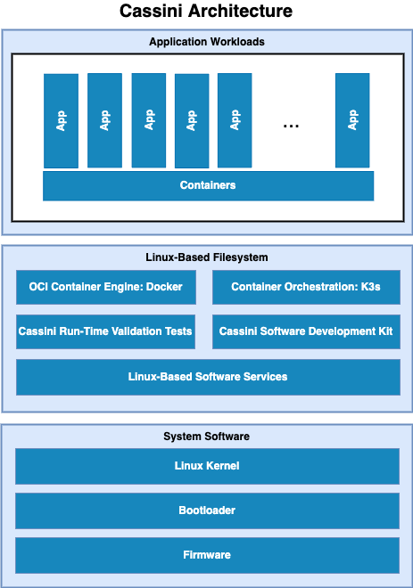

..
 # Copyright (c) 2022 Arm Limited or its affiliates. All rights reserved.
 #
 # SPDX-License-Identifier: MIT

############
Introduction
############

Project Cassini is the open, collaborative, standards-based initiative to
deliver a seamless cloud-native software experience for devices based on Arm
Cortex-A.

Initial release of Cassini distro will provide a framework for deployment and
orchestration of applications (edge runtime) within containers.

Future releases of Cassini distro will include support for platform abstraction
for security (PARSEC), provisioning the platform and update all components of
software stack over the air. In addition, optionally utilize PARSEC to secure
those operations.

************
Architecture
************

The following diagram illustrates the Cassini Architecture.

The different software layers are described below:

  * **Application workloads**:

    User-defined container applications that are deployed and executed on the
    Cassini software stack. Note that the Cassini project provides the system
    infrastructure for user workloads, and not the application workloads
    themselves. Instead, they should be deployed by end-users according to their
    individual use-cases.

  * **Linux-based filesystem**:

    This is the main component provided by the Cassini project. The Cassini
    filesystem contains tools and services that provide Cassini core
    functionalities and facilitate deployment and orchestration of user
    application workloads. These tools and services include the Docker
    container engine, the K3s container orchestration framework, together with
    their run-time dependencies. In addition, Cassini provides supporting
    packages such as those which enable run-time validation tests or software
    development capabilities on the target platform.

  * **System software**:

    System software specific to the target platform, composed of firmware,
    bootloader and the operating system.

********************
Repository Structure
********************

The ``meta-cassini`` repository is structured as follows:

  * ``meta-cassini``:

    * ``meta-cassini-distro``

      Yocto distribution layer providing top-level and general policies for the
      Cassini distribution images.

    * ``meta-cassini-tests``

      Yocto software layer with recipes that include run-time tests to validate
      Cassini functionalities.

    * ``meta-cassini-config``

      Directory which contains configuration files for running tools on Cassini,
      such as files to support use of the kas build tool, or Cassini-specific
      configuration for running automated quality-assurance checks.

******************
Repository License
******************

The repository's standard licence is the MIT license (more details in
:ref:`license_link:License`), under which most of the repository's content is
provided. Exceptions to this standard license relate to files that represent
modifications to externally licensed works (for example, patch files). These
files may therefore be included in the repository under alternative licenses in
order to be compliant with the licensing requirements of the associated external
works.

Contributions to the project should follow the same licensing arrangement.
